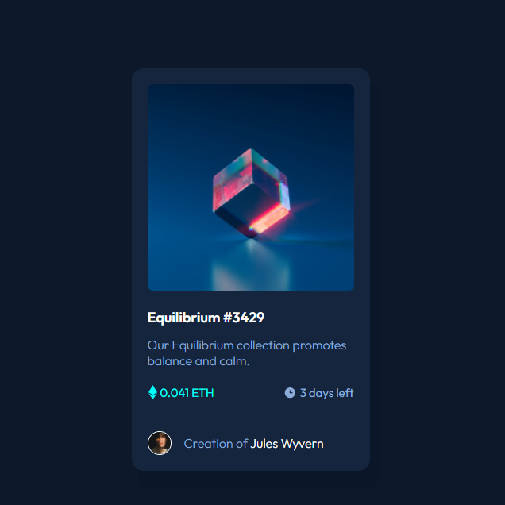

# Frontend Mentor - NFT preview card component solution

This is a solution to the [NFT preview card component challenge on Frontend Mentor](https://www.frontendmentor.io/challenges/nft-preview-card-component-SbdUL_w0U). Frontend Mentor challenges help you improve your coding skills by building realistic projects. 

## Table of contents

- [Overview](#overview)
  - [The challenge](#the-challenge)
  - [Screenshot](#screenshot)
  - [Links](#links)
- [My process](#my-process)
  - [Built with](#built-with)
  - [What I learned](#what-i-learned)
  - [Useful resources](#useful-resources)
- [Author](#author)

## Overview

### The challenge

Users should be able to:

- View the optimal layout depending on their device's screen size
- See hover states for interactive elements

### Screenshot



### Links

- Live Site URL: [Live on Vercel](https://nft-preview-card-frontend-mentor.vercel.app/)

## My process

### Built with

- Semantic HTML5 markup
- [Sass](https://sass-lang.com/)
- Flexbox
- [React](https://reactjs.org/)

### What I learned

Learned the basics of React and Sass.
How to use the clamp property to completely skip media queries. :))))))

### Useful resources

This was my first project built with React and Sass, so setting everything up took longer than i expected, but I am now 100% more confident on tackling both. I found out using functions as components is the best for a clean looking code, so I intend to use this snippet of code for React components from now on:

```js
function _Card() {
  return (
    <div className='card'>
    ...
    </div>
  )
}

export default _Card
```

As for Sass, finding where I can use mixins to speed up the coding is still a challenge. Overall, I just need more practice.

## Author

- Frontend Mentor - [mattreee](https://www.frontendmentor.io/profile/mattreee)
- Codepen - [asdjkl123](https://codepen.io/asdjkl123)
